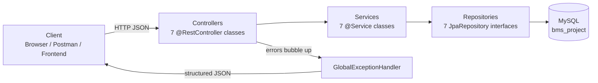
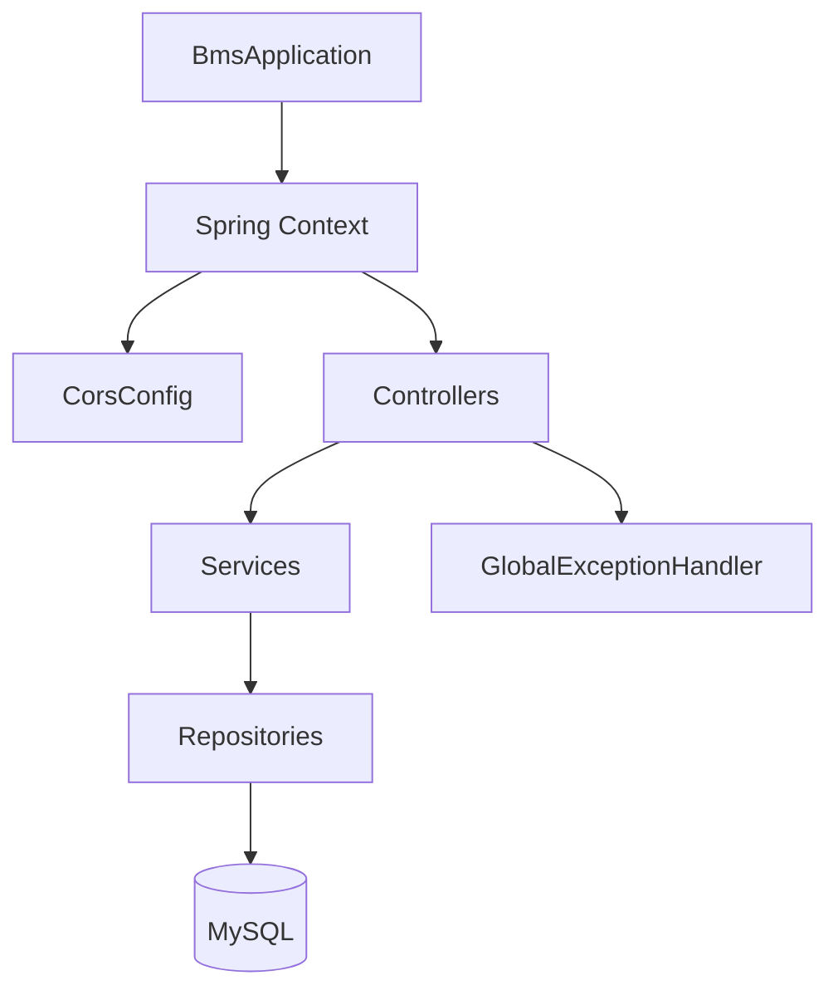
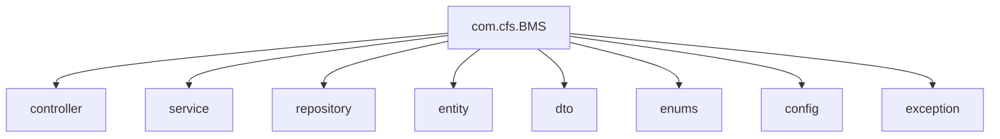
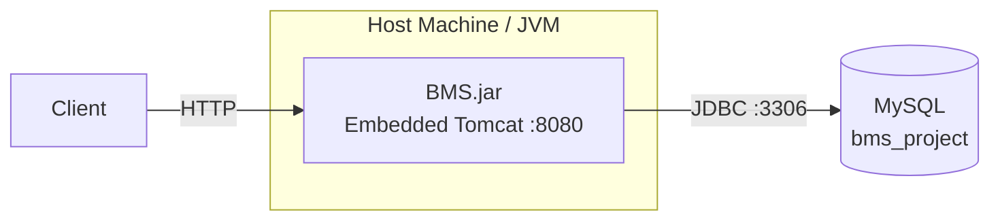
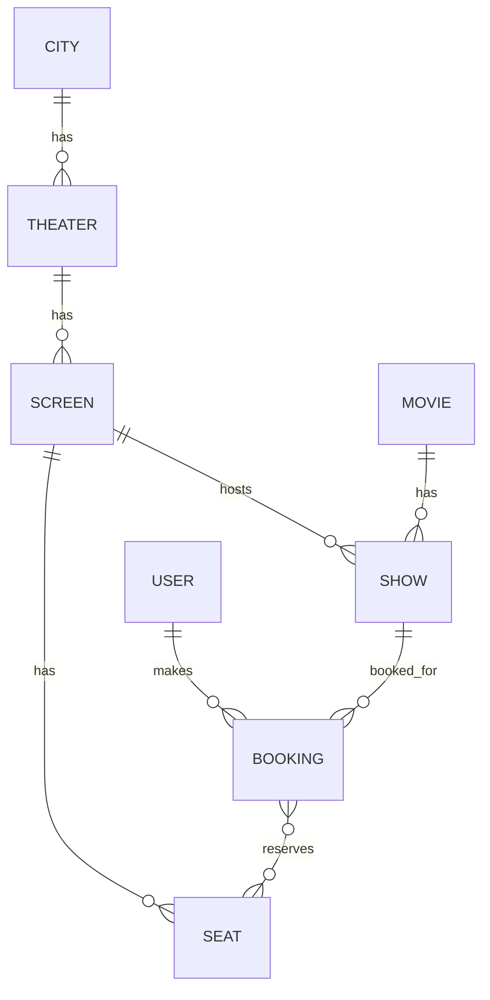

<div align="center">

# 🎬 BookMyShow Backend

### Movie Ticket Booking REST API — Cities, Theaters, Screens, Shows, Seats & Bookings

**Java 21 · Spring Boot 4.0.3 · Spring Data JPA · MySQL · Lombok**


</div>

---

> ⚠️ **Honesty Note on This README**
> This documents a **movie-ticket-booking backend modeled after BookMyShow** — a real layered Spring Boot application with controllers, services, repositories, entities, DTOs, and a global exception handler. It genuinely uses **MySQL + JPA/Hibernate**, unlike a toy project. That said, it does **not** currently have Spring Security, JWT, password hashing, Swagger, Docker, or any automated tests — these are called out explicitly as gaps rather than invented, and listed under **Future Improvements**. A couple of real bugs found during analysis are also documented honestly under [Challenges](#-challenges) and [Troubleshooting](#-troubleshooting), since the instructions for this documentation require reporting only what actually exists in the code — including its flaws.

---

## 📌 Table of Contents

- [Executive Summary](#-executive-summary)
- [Project Overview](#-project-overview)
- [Why This Project Exists](#-why-this-project-exists)
- [Resume Highlights](#-resume-highlights)
- [ATS Keywords](#-ats-keywords)
- [Features](#-features)
- [Technology Stack](#-technology-stack)
- [Project Folder Structure](#-project-folder-structure)
- [Architecture](#-architecture)
- [Complete Request Lifecycle](#-complete-request-lifecycle)
- [Complete Application Flow](#-complete-application-flow)
- [Authentication](#-authentication)
- [Database Design](#-database-design)
- [API Documentation](#-api-documentation)
- [Class Explanation](#-class-explanation)
- [Configuration](#-configuration)
- [External Integrations](#-external-integrations)
- [Installation Guide](#-installation-guide)
- [Docker](#-docker)
- [Deployment](#-deployment)
- [Testing](#-testing)
- [Validation](#-validation)
- [Exception Handling](#-exception-handling)
- [Logging](#-logging)
- [Security](#-security)
- [SQL](#-sql)
- [Performance](#-performance)
- [Challenges](#-challenges)
- [Future Improvements](#-future-improvements)
- [Troubleshooting](#-troubleshooting)
- [Interview Preparation](#-interview-preparation)
- [Developer Notes](#-developer-notes)
- [Quick Revision](#-quick-revision)
- [Project Explanation (Interview Answer)](#-project-explanation-interview-answer)
- [Contributing](#-contributing)
- [License](#-license)
- [Contact](#-contact)

---

## 🧭 Executive Summary

**What it does:** BookMyShow Backend is a layered Spring Boot REST API that models a movie-ticket-booking domain: cities, theaters, screens, seats, movies, shows, users, and bookings — all backed by a real MySQL database via Spring Data JPA/Hibernate.

**Who uses it:** Any frontend or client (web/mobile) that needs to browse movies and showtimes, register/login users, and book seats for a specific show, the way BookMyShow or similar platforms work.

**Business problem:** Coordinating movies, theater screens, showtimes, and seat inventory so that two users can never double-book the same seat for the same show.

**Business solution:** A relational schema that models the full booking domain (City → Theater → Screen → Seat, and Movie → Show), with a booking service that checks seat availability against confirmed bookings before persisting a new booking transactionally.

**Main features:** User registration/login, movie catalog (search by title/genre/language), theater and screen management, seat inventory, show scheduling, seat-availability lookup, and transactional seat booking with cancellation.

**Technical highlights:** Full DTO/Entity/Repository/Service/Controller layering, JPA relationships (`@ManyToOne`, `@ManyToMany` with a join table), a custom JPQL query to find already-booked seats, `@Transactional` booking logic, a global exception handler returning structured JSON errors, and Lombok-based boilerplate reduction throughout.

---

## 📖 Project Overview

In simple English: this is the backend for a movie-ticket-booking app. It knows about cities (e.g. "Pune"), theaters in those cities, screens inside those theaters, seats inside those screens, movies, and shows (a specific movie playing on a specific screen at a specific date/time with a ticket price). A user registers an account, browses movies and shows, checks which seats are still free for a show, and books one or more of those seats. The booking is saved with a total price (seats × ticket price) and a status (`CONFIRMED` or `CANCELLED`). Everything is persisted in a MySQL database.

---

## 🎯 Why This Project Exists

**Business requirement:** Provide the backend logic for an online movie-ticket-booking platform.

**Business problem:** Manually coordinating seat inventory across many theaters, screens, and showtimes — and preventing double-booking of the same seat — is a classic, well-known backend challenge.

**Expected users:** A frontend web or mobile app for moviegoers; internally, theater/admin-facing tools for adding cities, theaters, screens, seats, movies, and shows.

**Use cases:**
- A user registers, logs in, browses movies, and searches by title, genre, or language.
- A user picks a city, sees theaters in that city, and the screens/shows available for a movie.
- A user checks available seats for a specific show and books one or more of them.
- A user views their booking history or cancels an existing booking.

---

## 🏆 Resume Highlights

Recruiter-friendly bullet points for describing this project on a resume:

- Designed and built a **layered Spring Boot REST API** (Controller → Service → Repository → Entity) for a movie-ticket-booking domain with 7 resource areas: users, movies, theaters, screens, seats, shows, and bookings.
- Modeled a **relational schema in MySQL via Spring Data JPA/Hibernate**, including `@ManyToOne` relationships (Theater→City, Screen→Theater, Seat→Screen, Show→Movie/Screen, Booking→User/Show) and a `@ManyToMany` seat-to-booking relationship backed by a join table (`booking_seats`).
- Implemented **transactional seat-booking logic** (`@Transactional`) with a custom JPQL query to detect already-booked seats for a show and prevent double-booking before persisting.
- Built a **global exception handler** (`@RestControllerAdvice`) returning structured, timestamped JSON error responses across all endpoints.
- Reduced boilerplate across 7 entities and 7 DTOs using **Lombok** (`@Getter`, `@Setter`, `@Builder`, `@Data`, `@RequiredArgsConstructor`).
- Implemented **CORS configuration** via a `WebMvcConfigurer` bean to support cross-origin frontend consumption.
- Applied JPA lifecycle hooks (`@PrePersist`) to auto-populate timestamps and default statuses on entity creation.

---

## 🔑 ATS Keywords

`Java 21` · `Spring Boot` · `Spring MVC` · `Spring Data JPA` · `Hibernate` · `MySQL` · `RESTful API Design` · `Layered Architecture` · `DTO Pattern` · `Entity Relationship Modeling` · `One-to-Many` · `Many-to-Many` · `JPQL` · `Transactional Processing` · `Global Exception Handling` · `Lombok` · `CORS Configuration` · `Maven` · `Backend Development` · `Microservice Architecture` · `Relational Database Design` · `Booking System` · `Inventory Management` · `Git / GitHub`

---

## ✨ Features

### 1. User Registration & Login (`/api/users`)
| | |
|---|---|
| **Purpose** | Allow users to create an account and authenticate. |
| **Business value** | Required before a user can make a booking (a `Booking` requires a `User`). |
| **Technical implementation** | `UserService.register()` checks for duplicate email via `existsByEmail`, then persists via `UserRepository`. `login()` looks up by email and compares the stored password to the submitted one directly. |
| **Related classes** | `UserController`, `UserService`, `UserRepository`, `User`, `UserRequest`, `LoginRequest` |
| **Related APIs** | `POST /api/users/register`, `POST /api/users/login`, `GET /api/users`, `GET /api/users/{id}` |
| **Related database tables** | `users` |

### 2. Movie Catalog (`/api/movies`)
| | |
|---|---|
| **Purpose** | Manage and browse the movie catalog. |
| **Business value** | Lets users discover movies to book shows for, filtered by title, genre, or language. |
| **Technical implementation** | `MovieService` builds a `Movie` entity from `MovieRequest` and saves it; search methods delegate to derived JPA query methods (`findByTitleContainingIgnoreCase`, `findByGenre`, `findByLanguage`). |
| **Related classes** | `MovieController`, `MovieService`, `MovieRepository`, `Movie`, `MovieRequest` |
| **Related APIs** | `POST /api/movies` *(see note under [Troubleshooting](#-troubleshooting) — not currently reachable)*, `GET /api/movies`, `GET /api/movies/{id}`, `GET /api/movies/search?title=`, `GET /api/movies/genre/{genre}`, `GET /api/movies/genre/{language}` *(mapped for language — see note)* |
| **Related database tables** | `movies` |

### 3. City Directory (`/api/cities`)
| | |
|---|---|
| **Purpose** | Provide the list of cities the platform operates in. |
| **Business value** | Lets users narrow theaters/shows down to their city. |
| **Technical implementation** | Simple pass-through service over `CityRepository` (a plain `JpaRepository` with no custom queries). |
| **Related classes** | `CityController`, `CityService`, `CityRepository`, `City` |
| **Related APIs** | `GET /api/cities`, `GET /api/cities/{id}` |
| **Related database tables** | `cities` |

### 4. Theater Management (`/api/theaters`)
| | |
|---|---|
| **Purpose** | Manage theaters and link each to a city. |
| **Business value** | Theaters are the physical venues that host screens and shows. |
| **Technical implementation** | `TheaterService.addTheater()` resolves the `City` by ID via `CityService`, then builds and saves the `Theater`. |
| **Related classes** | `TheaterController`, `TheaterService`, `TheaterRepository`, `Theater`, `TheaterRequest` |
| **Related APIs** | `POST /api/theaters/addTheater`, `GET /api/theaters`, `GET /api/theaters/{id}`, `GET /api/theaters/city/{id}` |
| **Related database tables** | `theaters` (FK to `cities`) |

### 5. Screen Management (`/api/screens`)
| | |
|---|---|
| **Purpose** | Manage individual screens within a theater. |
| **Business value** | Screens are where shows actually play and hold seat inventory. |
| **Technical implementation** | `ScreenService.addScreen()` resolves the parent `Theater` via `TheaterService`, then builds/saves the `Screen`. |
| **Related classes** | `ScreenController`, `ScreenService`, `ScreenRepository`, `Screen`, `ScreenRequest` |
| **Related APIs** | `POST /api/screens/addScreen`, `GET /api/screens`, `GET /api/screens/{id}`, `GET /api/screens/theater/{theaterId}` |
| **Related database tables** | `screens` (FK to `theaters`) |

### 6. Seat Inventory (`/api/seats`)
| | |
|---|---|
| **Purpose** | Manage individual seats within a screen, including seat type. |
| **Business value** | Seats are the bookable unit — every booking references specific seats. |
| **Technical implementation** | `SeatService.addSeat()` resolves the parent `Screen`, then builds/saves the `Seat` with a `SeatType` enum (`REGULAR`, `PREMIUM`, `VIP`). |
| **Related classes** | `SeatController`, `SeatService`, `SeatRepository`, `Seat`, `SeatRequest`, `SeatType` |
| **Related APIs** | `POST /api/seats/addSeats`, `GET /api/seats/screen/{screenId}`, `GET /api/seats/{id}` |
| **Related database tables** | `seats` (FK to `screens`) |

### 7. Show Scheduling (`/api/shows`)
| | |
|---|---|
| **Purpose** | Schedule a specific movie on a specific screen at a specific date/time and price. |
| **Business value** | A "show" is the bookable event — this is what a `Booking` ultimately links to. |
| **Technical implementation** | `ShowService.addShow()` resolves the `Movie` and `Screen`, then builds/saves the `Show` with `showDate`, `start_time`, `endTime`, and `ticketPrice`. Query methods support lookup by movie, by screen, and by movie+date. |
| **Related classes** | `ShowController`, `ShowService`, `ShowRepository`, `Show`, `ShowRequest` |
| **Related APIs** | `POST /api/shows/addShows`, `GET /api/shows`, `GET /api/shows/{id}`, `GET /api/shows/movie/{id}`, `GET /api/shows/movie/{movieId}/date?date=` |
| **Related database tables** | `shows` (FK to `movies`, `screens`) |

### 8. Seat Booking & Availability (`/api/bookings`)
| | |
|---|---|
| **Purpose** | The core feature — book one or more seats for a show, prevent double-booking, and support cancellation. |
| **Business value** | This is the actual transaction that generates revenue in a real booking platform; correctness here (no double-booked seats) is the most business-critical requirement. |
| **Technical implementation** | `BookingService.createBooking()` (annotated `@Transactional`) resolves the `User` and `Show`, validates at least one seat was selected, runs a custom JPQL query (`findBookedSeatIdByShowId`) to find seats already booked (status `CONFIRMED`) for that show, rejects the request if any requested seat is already taken, validates all requested seat IDs actually exist, computes `totalPrice = seats.size() * ticketPrice`, and saves the `Booking`. `getAvailableSeats()` computes the free-seat list by filtering all seats on the show's screen against already-booked seat IDs. |
| **Related classes** | `BookingController`, `BookingService`, `BookingRepository`, `Booking`, `BookingReq`, `BookingStatus` |
| **Related APIs** | `POST /api/bookings`, `GET /api/bookings/{id}`, `GET /api/bookings/user/{userId}`, `PUT /api/bookings/{id}/cancel`, `GET /api/bookings/show/{showId}/available-seats` |
| **Related database tables** | `bookings`, `booking_seats` (join table), FK to `users`, `shows`, `seats` |

---

## 🛠 Technology Stack

| Technology | What It Is | Why Used Here | Advantages | Alternative |
|---|---|---|---|---|
| **Java 21** | LTS Java language/runtime version. | Modern language baseline for the whole app. | Performance, strong typing, long-term support. | Kotlin |
| **Spring Boot 4.0.3** | Opinionated framework for production-ready Spring apps. | Provides the embedded server, DI container, and auto-configuration for JPA/web/CORS. | Convention over configuration, huge ecosystem. | Micronaut, Quarkus |
| **Spring MVC** (`spring-boot-starter-webmvc`) | Spring's REST/web layer. | Powers all 7 `@RestController` classes. | Mature, annotation-driven routing. | WebFlux (reactive), JAX-RS |
| **Spring Data JPA** (`spring-boot-starter-data-jpa`) | Repository abstraction over JPA/Hibernate. | Every entity has a `JpaRepository` interface with derived query methods (e.g. `findByGenre`) and one custom `@Query` (JPQL) for booked-seat lookup. | Eliminates boilerplate DAO code, derived queries from method names. | MyBatis, plain JDBC |
| **Hibernate** | JPA implementation used under Spring Data JPA. | Actual ORM engine mapping entities to MySQL tables; `spring.jpa.hibernate.ddl-auto=update` auto-generates/updates the schema from entities. | Mature ORM, lazy loading, relationship mapping. | EclipseLink |
| **MySQL** (`mysql-connector-j`) | Relational database. | Stores all domain data — cities, theaters, screens, seats, movies, shows, users, bookings. | ACID transactions, mature tooling, wide hosting support. | PostgreSQL |
| **Lombok 1.18.44** | Annotation-based boilerplate generator. | Used on every entity and DTO for `@Getter`/`@Setter`/`@Builder`/`@Data`/`@AllArgsConstructor`/`@NoArgsConstructor`, and on services/controllers for `@RequiredArgsConstructor` (constructor injection). | Removes hundreds of lines of manual getter/setter/constructor code. | Manual boilerplate, records (for immutable DTOs) |
| **Maven** | Build automation tool. | Manages dependencies (`pom.xml`) and builds/runs the app via the Spring Boot Maven plugin; the Lombok annotation processor is wired into the compiler plugin. | Standardized structure, wrapper (`mvnw`) included. | Gradle |
| **Spring Boot DevTools** | Developer productivity tool (runtime-scoped, optional). | Enables automatic restart on code changes during local development. | Faster dev feedback loop. | Manual restarts |
| **Git / GitHub** | Version control and hosting. | Source control for this repository. | Industry standard. | GitLab, Bitbucket |

> **Not present in this codebase:** Spring Security, JWT, BCrypt/password hashing, Redis, Kafka, Swagger/OpenAPI, Docker, Spring AI, Mockito-based tests, JUnit test classes (the `spring-boot-starter-data-jpa-test` / `spring-boot-starter-webmvc-test` dependencies are declared in `pom.xml` but there is no `src/test` directory in the repository, so no actual tests exist to run).

---

## 📁 Project Folder Structure

```
BookMyShow_Backend/
├── pom.xml                                          # Maven build file — JPA, Web, MySQL, Lombok
├── mvnw / mvnw.cmd                                  # Maven wrapper scripts
├── .gitignore
├── .gitattributes
├── .mvn/wrapper/                                    # Maven wrapper jar/config
├── README.md
└── src/
    └── main/
        ├── java/com/cfs/BMS/
        │   ├── BmsApplication.java                  # @SpringBootApplication entry point
        │   ├── config/
        │   │   └── CorsConfig.java                  # Global CORS WebMvcConfigurer bean
        │   ├── controller/                          # 7 @RestController classes — HTTP layer
        │   │   ├── BookingController.java
        │   │   ├── CityController.java
        │   │   ├── MovieController.java
        │   │   ├── ScreenController.java
        │   │   ├── SeatController.java
        │   │   ├── ShowController.java
        │   │   ├── TheaterController.java
        │   │   └── UserController.java
        │   ├── dto/                                 # Request payload classes (no response DTOs)
        │   │   ├── BookingReq.java
        │   │   ├── LoginRequest.java
        │   │   ├── MovieRequest.java
        │   │   ├── ScreenRequest.java
        │   │   ├── SeatRequest.java
        │   │   ├── ShowRequest.java
        │   │   ├── TheaterRequest.java
        │   │   └── UserRequest.java
        │   ├── entity/                              # JPA @Entity classes — 7 tables
        │   │   ├── Booking.java
        │   │   ├── City.java
        │   │   ├── Movie.java
        │   │   ├── Screen.java
        │   │   ├── Seat.java
        │   │   ├── Show.java
        │   │   ├── Theater.java
        │   │   └── User.java
        │   ├── enums/
        │   │   ├── BookingStatus.java                # CONFIRMED, CANCELLED
        │   │   └── SeatType.java                     # REGULAR, PREMIUM, VIP
        │   ├── exception/
        │   │   └── GlobalExceptionHandler.java       # @RestControllerAdvice — structured JSON errors
        │   ├── repository/                           # 7 JpaRepository interfaces
        │   │   ├── BookingRepository.java             # includes 1 custom @Query (JPQL)
        │   │   ├── CityRepository.java
        │   │   ├── MovieRepository.java
        │   │   ├── ScreenRepository.java
        │   │   ├── SeatRepository.java
        │   │   ├── ShowRepository.java
        │   │   └── TheaterRepository.java
        │   │   └── UserRepository.java
        │   └── service/                              # 7 @Service classes — business logic
        │       ├── BookingService.java                # core booking/availability logic
        │       ├── CityService.java
        │       ├── MovieService.java
        │       ├── ScreenService.java
        │       ├── SeatService.java
        │       ├── ShowService.java
        │       ├── TheaterService.java
        │       └── UserService.java
        └── resources/
            └── application.properties                 # DB connection, JPA/Hibernate config, server port
```

**Package responsibilities:**
- `config/` — Spring `@Configuration` beans; currently just CORS.
- `controller/` — HTTP entry points; parse requests, delegate to services, wrap results in `ResponseEntity`.
- `dto/` — Plain request payload classes (Lombok `@Data`) used to decouple the API contract from JPA entities on the *inbound* side. There are no dedicated response DTOs — entities are returned directly.
- `entity/` — JPA-mapped domain objects, one per database table.
- `enums/` — Two domain enums used inside entities (`SeatType`, `BookingStatus`).
- `exception/` — Centralized error handling for the whole app.
- `repository/` — Spring Data JPA interfaces; mostly derived query methods plus one hand-written JPQL query.
- `service/` — Business logic layer; every service is a concrete class (no interfaces), injected via constructor (`@RequiredArgsConstructor` + `final` fields).

---

## 🏗 Architecture

### High-Level Architecture



### Component Diagram



### Package Diagram



### Deployment Diagram (current state)



> No containerization or multi-instance deployment topology is defined — this reflects a single-JVM + single-MySQL-instance local setup as-is.

---

## 🔄 Complete Request Lifecycle

Using `POST /api/bookings` (create booking) as the representative example, since it's the most complete flow in the app:

1. **Browser/Client** sends a `POST` request to `/api/bookings` with a JSON body: `{ "userId": 1, "showId": 2, "seatId": [5, 6] }`.
2. **Spring MVC routing** matches `BookingController#createBooking`, based on `@RequestMapping("/api/bookings")` + implicit `@PostMapping` (bare `@PostMapping` with no path).
3. **DTO binding**: Jackson deserializes the JSON body into a `BookingReq` DTO via `@RequestBody`.
4. **Validation**: None explicit — there is no `@Valid` or Bean Validation annotation on `BookingReq` or in the controller method signature.
5. **Service logic** (`BookingService#createBooking`, annotated `@Transactional`):
   - Fetches the `User` by ID (throws `RuntimeException` if not found).
   - Fetches the `Show` by ID (throws `RuntimeException` if not found).
   - Validates `seatId` is non-null and non-empty.
   - Runs the custom JPQL query `findBookedSeatIdByShowId` to get seat IDs already `CONFIRMED` for this show.
   - Rejects the request with a `RuntimeException` if any requested seat is already booked.
   - Fetches all requested `Seat` entities by ID and verifies the count matches (catches invalid seat IDs).
   - Computes `totalPrice = seats.size() * show.getTicketPrice()`.
   - Builds a `Booking` via the Lombok `@Builder`, defaulting `status` to `CONFIRMED`.
6. **Repository**: `BookingRepository.save(booking)` persists the entity (and the `booking_seats` join rows) via Hibernate.
7. **Database**: MySQL commits the transaction (or rolls back entirely if any exception was thrown mid-method, since the whole method is `@Transactional`).
8. **Response construction**: The saved `Booking` entity (including its generated ID and the `@PrePersist`-populated `bookedAt` timestamp) is wrapped in `ResponseEntity.ok(...)`.
9. **Serialization**: Jackson serializes the `Booking` entity graph (including nested `User`, `Show`, and `Seat` objects, since no response DTO strips them) to JSON.
10. **Response** is returned with `200 OK` on success, or is intercepted by `GlobalExceptionHandler` and returned as a structured JSON error (`400 Bad Request` for `RuntimeException`s, or an internal-error shape for other exceptions) if any step failed.

---

## ⚙️ Complete Application Flow

- **Startup**: `BmsApplication.main()` calls `SpringApplication.run(...)`.
- **Bean creation**: Spring Boot auto-configures the embedded Tomcat server, the `DataSource` (MySQL, via `mysql-connector-j`), the `EntityManagerFactory`/Hibernate session factory, and all `@Repository`, `@Service`, `@RestController`, and `@Configuration` beans via component scanning.
- **Dependency Injection**: Every controller and service uses constructor injection via Lombok's `@RequiredArgsConstructor` on `final` fields — no field injection (`@Autowired` on fields) is used anywhere.
- **Configuration loading**: `application.properties` is read at startup — datasource URL/credentials, `spring.jpa.hibernate.ddl-auto=update`, `spring.jpa.show-sql=true`, and `server.port=8080`.
- **Security initialization**: None — no Spring Security dependency, so no filter chain is initialized.
- **Database connection**: On startup, Spring Boot connects to `jdbc:mysql://localhost:3306/bms_project` (auto-creating the database if it doesn't exist, per `createDatabaseIfNotExist=true`), and Hibernate updates the schema to match the entity classes (`ddl-auto=update`).
- **Request handling**: As described in [Complete Request Lifecycle](#-complete-request-lifecycle).
- **Response generation**: JSON responses built per request via Jackson.
- **Shutdown**: Standard Spring Boot graceful shutdown of Tomcat and the Hibernate session factory/connection pool.

---

## 🔐 Authentication

There is a **login endpoint** (`POST /api/users/login`) but **no session, token, or Spring Security integration** behind it. `UserService.login()` looks the user up by email and compares the submitted password to the stored password with a direct `String.equals()` check — there is no JWT issued, no session created, and no password hashing (see [Security](#-security) for the full detail). In practice, calling `/login` today just verifies credentials and returns the `User` object; it does not grant the caller any special access to subsequent requests, since every other endpoint is open regardless of login state.

**Not present:** JWT generation/validation, Spring Security filter chain, role-based access control, logout/token invalidation.

---

## 🗄 Database Design

The schema is defined entirely through JPA entity annotations (`ddl-auto=update` generates it automatically) — there are no standalone `.sql` files in the repository. Below is the schema as inferred directly from the entity classes.

### Tables

**`users`**
| Column | Type | Constraints |
|---|---|---|
| id | BIGINT | PK, auto-increment (IDENTITY) |
| name | VARCHAR | NOT NULL |
| email | VARCHAR | NOT NULL, UNIQUE |
| password | VARCHAR | NOT NULL |
| phone | VARCHAR | nullable |
| created_at | DATETIME | set via `@PrePersist` |

**`movies`**
| Column | Type | Constraints |
|---|---|---|
| id | BIGINT | PK |
| title | VARCHAR | NOT NULL |
| description | VARCHAR | nullable |
| genre | VARCHAR | nullable |
| language | VARCHAR | nullable |
| duration_minutes | INT | nullable |
| rating | DOUBLE | nullable |
| release_date | DATE | nullable |
| poster_url | VARCHAR | nullable |

**`cities`**
| Column | Type | Constraints |
|---|---|---|
| id | BIGINT | PK |
| name | VARCHAR | NOT NULL, UNIQUE |
| state | VARCHAR | nullable |

**`theaters`**
| Column | Type | Constraints |
|---|---|---|
| id | BIGINT | PK |
| name | VARCHAR | NOT NULL, UNIQUE |
| address | VARCHAR | nullable |
| city_id | BIGINT | FK → `cities.id`, NOT NULL |

**`screens`**
| Column | Type | Constraints |
|---|---|---|
| id | BIGINT | PK |
| name | VARCHAR | NOT NULL |
| total_seats | INT | nullable |
| theater_id | BIGINT | FK → `theaters.id`, NOT NULL |

**`seats`**
| Column | Type | Constraints |
|---|---|---|
| id | BIGINT | PK |
| seat_number | VARCHAR | NOT NULL |
| seat_row | VARCHAR | nullable |
| seat_col | INT | nullable |
| seat_type | VARCHAR (enum: REGULAR/PREMIUM/VIP) | nullable |
| screen_id | BIGINT | FK → `screens.id`, NOT NULL |

**`shows`**
| Column | Type | Constraints |
|---|---|---|
| id | BIGINT | PK |
| movie_id | BIGINT | FK → `movies.id`, NOT NULL |
| screen_id | BIGINT | FK → `screens.id`, NOT NULL |
| show_date | DATE | nullable |
| start_time | TIME | nullable |
| end_time | TIME | nullable |
| ticket_price | DOUBLE | nullable |

**`bookings`**
| Column | Type | Constraints |
|---|---|---|
| id | BIGINT | PK |
| user_id | BIGINT | FK → `users.id`, NOT NULL |
| show_id | BIGINT | FK → `shows.id`, NOT NULL |
| total_price | DOUBLE | nullable |
| status | VARCHAR (enum: CONFIRMED/CANCELLED) | set via `@PrePersist` if null |
| booked_at | DATETIME | set via `@PrePersist` |

**`booking_seats`** *(join table, auto-generated by the `@ManyToMany` mapping)*
| Column | Type | Constraints |
|---|---|---|
| booking_id | BIGINT | FK → `bookings.id` |
| seat_id | BIGINT | FK → `seats.id` |

### Relationships
- `City` 1 → * `Theater`
- `Theater` 1 → * `Screen`
- `Screen` 1 → * `Seat`
- `Movie` 1 → * `Show`
- `Screen` 1 → * `Show`
- `User` 1 → * `Booking`
- `Show` 1 → * `Booking`
- `Booking` * ↔ * `Seat` (via `booking_seats` join table)

### ER Diagram



> **Note**: Indexes beyond the implicit primary-key and unique-constraint indexes (`users.email`, `cities.name`, `theaters.name`) are not explicitly defined anywhere in the code — Hibernate's default `ddl-auto=update` behavior does not add extra performance indexes automatically.

---

## 📡 API Documentation

### Users

| Method | URL | Purpose | Auth | Body |
|---|---|---|---|---|
| POST | `/api/users/register` | Register a new user | None | `UserRequest` |
| POST | `/api/users/login` | Verify credentials | None | `LoginRequest` |
| GET | `/api/users` | List all users | None | — |
| GET | `/api/users/{id}` | Get user by ID | None | — |

**Example — Register:**
```bash
curl -X POST http://localhost:8080/api/users/register \
  -H "Content-Type: application/json" \
  -d '{"name":"Mohit","email":"mohit@example.com","password":"secret123","phone":"9999999999"}'
```
**Success Response:** `200 OK` — the created `User` JSON (including plaintext `password` field, as returned directly).
**Error Response:** `400 Bad Request` — `{"timestamp":"...","message":"Email already exists: mohit@example.com","status":400}` (from `GlobalExceptionHandler`).
**Related Service/Repository:** `UserService` / `UserRepository`

---

### Movies

| Method | URL | Purpose | Auth | Body |
|---|---|---|---|---|
| POST | *(no route currently mapped — see note below)* | Add a movie | None | `MovieRequest` |
| GET | `/api/movies` | List all movies | None | — |
| GET | `/api/movies/{id}` | Get movie by ID | None | — |
| GET | `/api/movies/search?title=` | Search by title (contains, case-insensitive) | None | — |
| GET | `/api/movies/genre/{genre}` | Filter by genre | None | — |
| GET | `/api/movies/genre/{language}` | Filter by language *(mapped to the same path template as genre — see note)* | None | — |

> **Note:** `MovieController#addMovie` has no `@PostMapping`/`@RequestMapping` annotation above the method, so it is currently **not exposed as an HTTP endpoint** — calling any URL won't reach it. See [Troubleshooting](#-troubleshooting).
> **Note:** `getByGenre` and `getByLanguage` are both mapped to the literal path `/genre/{...}` (Spring matches on the path template, not the variable name), which is an ambiguous mapping — see [Challenges](#-challenges).

**Example — List Movies:**
```bash
curl http://localhost:8080/api/movies
```
**Related Service/Repository:** `MovieService` / `MovieRepository`

---

### Cities

| Method | URL | Purpose | Auth | Body |
|---|---|---|---|---|
| GET | `/api/cities` | List all cities | None | — |
| GET | `/api/cities/{id}` | Get city by ID | None | — |

> Note: `CityController` has no `POST` endpoint — cities can only be created directly via `CityService.addCity(City)`, which is not wired to any controller route.

**Related Service/Repository:** `CityService` / `CityRepository`

---

### Theaters

| Method | URL | Purpose | Auth | Body |
|---|---|---|---|---|
| POST | `/api/theaters/addTheater` | Add a theater | None | `TheaterRequest` |
| GET | `/api/theaters` | List all theaters | None | — |
| GET | `/api/theaters/{id}` | Get theater by ID | None | — |
| GET | `/api/theaters/city/{id}` | List theaters in a city | None | — |

**Example:**
```bash
curl -X POST http://localhost:8080/api/theaters/addTheater \
  -H "Content-Type: application/json" \
  -d '{"name":"PVR Phoenix","address":"Viman Nagar","cityId":1}'
```
**Error Response (city not found):** `400 Bad Request` — `{"timestamp":"...","message":"City not found with id: 1","status":400}`
**Related Service/Repository:** `TheaterService` / `TheaterRepository`

---

### Screens

| Method | URL | Purpose | Auth | Body |
|---|---|---|---|---|
| POST | `/api/screens/addScreen` | Add a screen | None | `ScreenRequest` |
| GET | `/api/screens` | List all screens | None | — |
| GET | `/api/screens/{id}` | Get screen by ID | None | — |
| GET | `/api/screens/theater/{theaterId}` | List screens in a theater | None | — |

**Related Service/Repository:** `ScreenService` / `ScreenRepository`

---

### Seats

| Method | URL | Purpose | Auth | Body |
|---|---|---|---|---|
| POST | `/api/seats/addSeats` | Add a seat | None | `SeatRequest` |
| GET | `/api/seats/screen/{screenId}` | List seats on a screen | None | — |
| GET | `/api/seats/{id}` | Get seat by ID | None | — |

**Related Service/Repository:** `SeatService` / `SeatRepository`

---

### Shows

| Method | URL | Purpose | Auth | Body |
|---|---|---|---|---|
| POST | `/api/shows/addShows` | Schedule a show | None | `ShowRequest` |
| GET | `/api/shows` | List all shows | None | — |
| GET | `/api/shows/{id}` | Get show by ID | None | — |
| GET | `/api/shows/movie/{id}` | List shows for a movie | None | — |
| GET | `/api/shows/movie/{movieId}/date?date=YYYY-MM-DD` | List shows for a movie on a date | None | — |

> Note: `getShowByMovieAndDate`'s `movieId` path variable is annotated with `@DateTimeFormat(iso = DateTimeFormat.ISO.DATE)`, which is meant for date-typed parameters — applying it to a `Long` has no functional effect and looks like a copy-paste artifact, but doesn't break the endpoint.

**Related Service/Repository:** `ShowService` / `ShowRepository`

---

### Bookings

| Method | URL | Purpose | Auth | Body |
|---|---|---|---|---|
| POST | `/api/bookings` | Create a booking | None | `BookingReq` |
| GET | `/api/bookings/{id}` | Get booking by ID | None | — |
| GET | `/api/bookings/user/{userId}` | List a user's bookings | None | — |
| PUT | `/api/bookings/{id}/cancel` | Cancel a booking | None | — |
| GET | `/api/bookings/show/{showId}/available-seats` | List free seats for a show | None | — |

**Example — Create Booking:**
```bash
curl -X POST http://localhost:8080/api/bookings \
  -H "Content-Type: application/json" \
  -d '{"userId":1,"showId":2,"seatId":[5,6]}'
```
**Success Response:** `200 OK` — the saved `Booking` (with generated `id`, `totalPrice`, `status: "CONFIRMED"`, `bookedAt`).
**Error Response (seat already booked):** `400 Bad Request` — `{"timestamp":"...","message":"Seat with id 5 is already Booked","status":400}`
**Related Service/Repository:** `BookingService` / `BookingRepository`, `SeatRepository`, plus `UserService` and `ShowService` for lookups.

---

## 🧩 Class Explanation

### `BmsApplication`
- **Purpose**: Spring Boot entry point.
- **Interview explanation**: "Standard `@SpringBootApplication` main class — bootstraps component scanning, auto-configuration (including the MySQL `DataSource` and Hibernate `EntityManagerFactory`), and the embedded Tomcat server."

### `CorsConfig`
- **Purpose**: Globally allows cross-origin requests.
- **Responsibilities**: Registers a `WebMvcConfigurer` bean whose `addCorsMappings` allows all origins (`*`), `GET/POST/PUT/DELETE/OPTIONS`, and all headers, on every path (`/**`).
- **Interview explanation**: "This is a `@Configuration` class exposing a single `@Bean` of type `WebMvcConfigurer`. Rather than annotating each controller with `@CrossOrigin`, this centralizes CORS policy in one place, applied globally."

### `GlobalExceptionHandler`
- **Purpose**: Centralized exception-to-JSON-response translation for every controller.
- **Responsibilities**: Two handlers — one for `RuntimeException` (used throughout services for "not found" and business-rule violations, e.g. duplicate email, seat already booked), returning `400 Bad Request` with `{timestamp, message, status}`; one catch-all for `Exception`, returning a similarly shaped body (though it's still built with `ResponseEntity.badRequest()` — see [Troubleshooting](#-troubleshooting) for a note on this).
- **Interview explanation**: "`@RestControllerAdvice` intercepts exceptions thrown from any controller in the application, so individual controllers don't need try/catch blocks. Every 'not found' or business-rule violation in this codebase is thrown as a plain `RuntimeException` with a descriptive message, which this class catches and turns into a structured JSON error body with a timestamp."

### `BookingService` (the most important business-logic class)
- **Purpose**: Owns the core booking domain logic — the one place in the app with real business rules beyond basic CRUD.
- **Responsibilities**: Validates seat selection, prevents double-booking via a JPQL lookup of already-confirmed seat IDs for a show, validates seat ID existence, computes total price, persists the booking transactionally, supports cancellation and availability lookups.
- **Dependencies**: `BookingRepository`, `SeatRepository`, `UserService`, `ShowService` (service-to-service composition rather than repeating repository calls).
- **Interview explanation**: "`createBooking` is wrapped in `@Transactional` so that if any validation fails partway through — say, seats turn out to be invalid after the already-booked check passes — nothing partial gets committed. The double-booking check works by running a JPQL query that joins `Booking` to its `seats` collection, filtered to `CONFIRMED` bookings for the target show, and returning just the seat IDs — an efficient way to answer 'which seats are taken for this show' without loading full entities."

### Entities (`Booking`, `City`, `Movie`, `Screen`, `Seat`, `Show`, `Theater`, `User`)
- **Purpose**: Each is a `@Entity`-annotated JPA class mapping 1:1 to a database table, built with Lombok (`@Getter @Setter @AllArgsConstructor @NoArgsConstructor @Builder`).
- **Interview explanation**: "Using Lombok's `@Builder` alongside `@NoArgsConstructor`/`@AllArgsConstructor` gives both a fluent, readable construction API in the service layer (`Booking.builder()...build()`) and the no-args constructor JPA requires internally for entity instantiation via reflection."

### DTOs (`*Request`, `LoginRequest`)
- **Purpose**: Decouple the inbound API request shape from the JPA entity shape — e.g. `TheaterRequest` takes a `cityId` (Long) instead of a full `City` object, which the service resolves.
- **Interview explanation**: "There are no outbound/response DTOs in this project — controllers return entities directly, which means the full entity graph (including nested related entities) gets serialized to the client. That's a common early-stage shortcut worth calling out and fixing before production, since it can leak more data than intended and couples the API contract directly to the database schema."

---

## 🔧 Configuration

### `application.properties` (full contents)
```properties
spring.application.name=BMS

spring.datasource.url=jdbc:mysql://localhost:3306/bms_project?createDatabaseIfNotExist=true
spring.datasource.username=root
spring.datasource.password=mohit123

spring.jpa.hibernate.ddl-auto=update
spring.jpa.show-sql=true

server.port=8080
```

| Property | Purpose |
|---|---|
| `spring.application.name` | Names the application. |
| `spring.datasource.url` | MySQL connection string; auto-creates the `bms_project` database if missing. |
| `spring.datasource.username` / `password` | MySQL credentials. |
| `spring.jpa.hibernate.ddl-auto=update` | Hibernate auto-generates/updates tables from entity classes on startup. |
| `spring.jpa.show-sql=true` | Logs every generated SQL statement to the console. |
| `server.port=8080` | Embedded Tomcat port. |

> ⚠️ **Security note**: the real MySQL username and password are **hardcoded directly in `application.properties` and committed to the repository** — see [Security](#-security) and [Future Improvements](#-future-improvements).

### `pom.xml`
- Parent: `spring-boot-starter-parent` version `4.0.3`.
- Java version: `21`.
- Dependencies: `spring-boot-starter-data-jpa`, `spring-boot-starter-webmvc`, `spring-boot-devtools` (runtime, optional), `mysql-connector-j` (runtime), `lombok` (provided), `spring-boot-starter-data-jpa-test` and `spring-boot-starter-webmvc-test` (test scope — declared but unused, since no test classes exist).
- Build: `maven-compiler-plugin` wired with the Lombok annotation processor; `spring-boot-maven-plugin` configured to exclude Lombok from the final fat JAR.

### Docker / docker-compose
**Not present** — no `Dockerfile` or `docker-compose.yml` exists in this repository.

---

## 🔌 External Integrations

### MySQL (via Spring Data JPA / Hibernate)
- **Purpose**: Primary datastore for the entire domain.
- **Configuration**: `spring.datasource.*` properties in `application.properties`.
- **Authentication**: Username/password, currently hardcoded (see [Security](#-security)).
- **Data flow**: Entities ↔ Hibernate ORM ↔ JDBC ↔ MySQL.
- **Error handling**: Data-access exceptions (e.g. constraint violations) are not specifically caught — they would fall through to `GlobalExceptionHandler`'s generic `Exception` handler.

> **Not present**: Redis, Kafka, Spring AI/OpenAI/Gemini, SMTP, Cloudinary, Swagger, Google Drive, Apache Tika, JWT — none of these appear anywhere in `pom.xml` or the source code.

---

## 🚀 Installation Guide

### Prerequisites
- **Java 21+** — [Adoptium Temurin](https://adoptium.net/)
- **Maven 3.8+** (or use the included `mvnw` wrapper)
- **Git**
- **MySQL 8+** running locally (or reachable at the configured host)

### Step-by-Step

**1. Clone the repository**
```bash
git clone https://github.com/mohitpawar61/BookMyShow_Backend.git
cd BookMyShow_Backend
```

**2. Install and start MySQL**, then make sure it's reachable at `localhost:3306` (or update `application.properties` to match your setup).

**3. Configure the database credentials**

Open `src/main/resources/application.properties` and set your own MySQL username/password rather than using the committed defaults:
```properties
spring.datasource.username=your_mysql_user
spring.datasource.password=your_mysql_password
```
> The app will auto-create the `bms_project` database on first run (`createDatabaseIfNotExist=true`) and auto-create/update all tables (`ddl-auto=update`) — no manual schema setup is required.

**4. Build the project**
```bash
./mvnw clean install       # macOS/Linux
mvnw.cmd clean install     # Windows
```

**5. Run the application**
```bash
./mvnw spring-boot:run
```
Or run the packaged JAR:
```bash
./mvnw clean package
java -jar target/BMS-0.0.1-SNAPSHOT.jar
```

**6. Verify it's running**

The app starts on `http://localhost:8080`. With `spring.jpa.show-sql=true`, you'll see the generated `CREATE TABLE`/`ALTER TABLE` statements in the console on first boot. Test endpoints with Postman or cURL as shown in [API Documentation](#-api-documentation). There is no Swagger UI in this project.

**Suggested manual verification order** (since data has FK dependencies): create a city → create a theater (needs city ID) → create a screen (needs theater ID) → create seats (needs screen ID) → create a movie → create a show (needs movie ID + screen ID) → register a user → create a booking (needs user ID, show ID, seat IDs).

---

## 🐳 Docker

**Not present in current version.** No `Dockerfile` or `docker-compose.yml` exists in the repository. See [Future Improvements](#-future-improvements) for a suggested addition (useful here in particular, since the app depends on a MySQL instance that would benefit from `docker-compose` orchestration).

---

## 🚢 Deployment

The only documented path today is running the built JAR on a host with Java 21 and a reachable MySQL instance, with credentials set directly in `application.properties`. There is no CI/CD pipeline, containerization, or cloud deployment configuration in the repository.

**Production considerations for a project at this stage:**
- Move DB credentials to environment variables — never ship hardcoded credentials.
- Change `spring.jpa.hibernate.ddl-auto` from `update` to a migration-tool-managed strategy (e.g. Flyway/Liquibase) before production use — `update` is convenient for development but risky for production schema changes.
- Restrict CORS from `allowedOrigins("*")` to specific known origins.
- Add authentication/authorization before any public deployment, since every endpoint — including creating theaters, movies, and bookings — is currently open to anyone.

---

## 🧪 Testing

**No test classes exist in this repository** — there is no `src/test` directory at all, despite `pom.xml` declaring `spring-boot-starter-data-jpa-test` and `spring-boot-starter-webmvc-test` as test-scoped dependencies. There is no Swagger UI either. The only way to exercise the API currently is **manual testing via Postman or cURL**, using the examples in [API Documentation](#-api-documentation).

---

## ✅ Validation

There is **no Bean Validation** (`@Valid`, `@NotNull`, `@NotBlank`, etc.) anywhere in the codebase — not on entities, not on DTOs, not on controller method parameters. The only validation that exists is **manual, business-rule validation inside service methods**, for example:
- `UserService.register()` checks for duplicate email before saving.
- `UserService.login()` checks the password matches.
- `BookingService.createBooking()` checks that at least one seat was selected, that no requested seat is already booked, and that all requested seat IDs are valid.

There is no validation preventing, for example, a negative `ticketPrice`, an empty movie `title` at the DTO level (only the entity has `@Column(nullable = false)`, which only takes effect at the database layer on save), or malformed emails.

---

## ⚠️ Exception Handling

A real `GlobalExceptionHandler` (`@RestControllerAdvice`) exists and is used consistently — every "not found" and business-rule check throughout the service layer throws a plain `RuntimeException` with a descriptive message, which is caught centrally and converted into a JSON body: `{ "timestamp": ..., "message": ..., "status": 400 }`. A second, catch-all handler exists for generic `Exception`, though it's worth noting it also calls `ResponseEntity.badRequest()` (HTTP 400) even though its own `error` map sets `"status"` to `500` internally — meaning the actual HTTP status code returned doesn't match the `status` field inside the JSON body for unexpected (non-`RuntimeException`) errors. There are no custom exception classes (e.g. `SeatAlreadyBookedException`, `ResourceNotFoundException`) — everything uses generic `RuntimeException`.

---

## 📝 Logging

There is no custom logging configuration (no `logback-spring.xml`, no `Logger` usage in source code). The one relevant setting is `spring.jpa.show-sql=true`, which makes Hibernate print every generated SQL statement to the console — useful for development debugging, but typically disabled in production since it's verbose and can leak query structure/data in logs.

---

## 🔒 Security

This section documents what's actually in the code, including gaps:

- **No Spring Security dependency** — no filter chain, no `@PreAuthorize`, no role-based access control.
- **No JWT or session-based authentication** — the `/login` endpoint verifies credentials but issues nothing back to authorize future requests.
- **Passwords are stored and compared in plain text.** `UserService.register()` saves `request.getPassword()` directly with no hashing, and `login()` compares with `user.getPassword().equals(request.getPassword())`. There is no BCrypt or any password encoder anywhere in the project. This is the single most important item to fix before this could be used with real user data.
- **CORS is fully open** — `allowedOrigins("*")` in `CorsConfig`.
- **CSRF**: not applicable/not configured (no Spring Security, no session-based forms).
- **SQL injection**: not a practical risk here, since all data access goes through Spring Data JPA repository methods and one parameterized `@Query` (`:showId`) — there is no raw/concatenated SQL anywhere in the codebase.
- **Credentials in source control**: the MySQL username and password are hardcoded in `application.properties`, which is committed to the repository — a real exposure risk if this repo is public with real credentials.

---

## 🗃 SQL

There are no `.sql` scripts in the repository — the schema is generated entirely by Hibernate from the JPA entity annotations. The one hand-written query in the project is this JPQL query in `BookingRepository`:

```java
@Query("SELECT s.id FROM Booking b JOIN b.seats s WHERE b.show.id = :showId AND b.status = 'CONFIRMED'")
List<Long> findBookedSeatIdByShowId(@Param("showId") Long showId);
```
This performs a join across the `Booking`→`Seat` many-to-many relationship, filtering to confirmed bookings for a given show, and projecting just the seat IDs — the core query that makes double-booking prevention possible. All other data access uses Spring Data JPA derived query methods (e.g. `findByGenre`, `findByTitleContainingIgnoreCase`, `findByCity_id`), which Spring translates into SQL automatically — there's no manually written SQL for those.

---

## ⚡ Performance

There is no caching, no pagination (every `findAll()` — movies, theaters, shows, bookings — returns the entire table with no `Pageable` support), and no explicit connection-pooling configuration beyond Spring Boot's HikariCP defaults (which are used automatically since no alternative pool is configured). The one transactional boundary in the app is `BookingService.createBooking()`'s `@Transactional` annotation. As the movie/show/booking tables grow, the lack of pagination on list endpoints (especially `GET /api/movies`, `GET /api/shows`, `GET /api/bookings/user/{userId}`) would become a real performance concern.

---

## 🧗 Challenges

Real issues found in the codebase during analysis, documented honestly rather than glossed over:

- **`MovieController#addMovie` is missing its HTTP mapping annotation.** The method has no `@PostMapping` (or any `@RequestMapping`) above it, so it's dead code from an HTTP-routing perspective — there is currently no way to add a movie through the REST API at all, even though `MovieService.addMovies()` and `MovieRequest` fully support it.
- **Ambiguous route mapping in `MovieController`.** `getByGenre` (`@GetMapping("/genre/{genre}")`) and `getByLanguage` (`@GetMapping("/genre/{language}")`) are mapped to the *same literal path template* — Spring MVC matches on the path pattern text, not the variable name, so these two mappings collide. Depending on the exact Spring Boot version's strictness, this either throws an `IllegalStateException: Ambiguous mapping` at application startup, or silently only the first-registered mapping is ever reachable. Either way, language-based filtering is not currently reliable through this route.
- **No password hashing**, discussed fully in [Security](#-security) — flagged here too since it's the most significant design gap in the project.
- **Preventing double-booked seats under concurrency.** The current solution (a pre-check query inside a `@Transactional` method) works for sequential requests, but under true concurrent load (two users booking the same seat at the same instant), MySQL's default isolation level may still allow both transactions to pass the "already booked?" check before either commits, resulting in a race condition. A more robust solution would add a unique constraint on `(show_id, seat_id)` at the database level in the join table, or use pessimistic/optimistic locking.

---

## 🛣 Future Improvements

| Priority | Improvement |
|---|---|
| High | Fix the missing `@PostMapping` on `MovieController#addMovie`. |
| High | Fix the duplicate `/genre/{...}` route mapping in `MovieController`. |
| High | Hash passwords with BCrypt (`spring-boot-starter-security` provides `BCryptPasswordEncoder`) instead of storing/comparing plaintext. |
| High | Move DB credentials out of `application.properties` into environment variables. |
| High | Add Spring Security + JWT so `/login` actually authorizes subsequent requests, and lock down write endpoints (POST/PUT/DELETE). |
| Medium | Add a unique DB constraint on `(show_id, seat_id)` in `booking_seats` to make double-booking prevention race-condition-safe at the database level, not just the application level. |
| Medium | Add response DTOs so entities (with full nested relationships) aren't serialized directly to clients. |
| Medium | Add Bean Validation (`@Valid`, `@NotBlank`, `@Min`, etc.) on all request DTOs. |
| Medium | Add pagination (`Pageable`) to all list endpoints. |
| Medium | Add Swagger/OpenAPI documentation. |
| Medium | Replace `ddl-auto=update` with a proper migration tool (Flyway or Liquibase) before production use. |
| Low | Add a `Dockerfile` + `docker-compose.yml` (app + MySQL) for one-command local setup. |
| Low | Add unit/integration tests — the test dependencies are already declared in `pom.xml` but unused. |
| Low | Restrict CORS to specific known origins instead of `*`. |
| Low | Add custom exception classes (e.g. `ResourceNotFoundException`, `SeatAlreadyBookedException`) instead of generic `RuntimeException` everywhere, for clearer, more specific error handling and HTTP status mapping. |

---

## 🩹 Troubleshooting

| Problem | Why It Happens | Solution |
|---|---|---|
| App fails to start with `Ambiguous mapping` error | `MovieController`'s `getByGenre` and `getByLanguage` are both mapped to `/genre/{...}`. | Rename one of the paths (e.g. `/language/{language}`) in `MovieController` before running. |
| Can't add a movie through the API | `addMovie` in `MovieController` has no HTTP method annotation. | Add `@PostMapping` above the method (matching the pattern used in other controllers, e.g. `@PostMapping("/addMovie")`) before it can be called. |
| `Communications link failure` / can't connect to DB on startup | MySQL isn't running, or isn't reachable at `localhost:3306`, or credentials in `application.properties` don't match your local MySQL setup. | Start MySQL locally and confirm the `spring.datasource.*` values match your actual username/password. |
| Booking fails with "Seat with id X is already Booked" | The seat is already tied to a `CONFIRMED` booking for that show — this is the intended double-booking prevention. | Choose a different seat, or check `GET /api/bookings/show/{showId}/available-seats` first. |
| Booking fails with "Some Seats Are Invalid" | One or more submitted seat IDs don't exist in the database. | Verify seat IDs via `GET /api/seats/screen/{screenId}` before booking. |
| Full nested entity data (e.g. a `Booking`'s entire `User` and `Show` objects) shows up in every response | No response DTOs exist — controllers return JPA entities directly, and Jackson serializes the whole object graph. | This is a known architectural gap — see [Future Improvements](#-future-improvements). |

---

## 🎤 Interview Preparation

**Q1: Walk me through what happens when a user books a seat.**
> A: The client posts a `BookingReq` with a user ID, show ID, and list of seat IDs to `/api/bookings`. `BookingController` delegates to `BookingService.createBooking`, which runs inside a `@Transactional` boundary. It fetches the user and show, validates seats were selected, runs a JPQL query to find seats already confirmed-booked for that show, rejects the request if there's overlap, validates the requested seat IDs actually exist, computes the total price as seat count times ticket price, and saves a new `Booking` with status `CONFIRMED`. Any failure along the way throws a `RuntimeException`, which `GlobalExceptionHandler` turns into a structured `400` JSON error.

**Q2: How do you prevent two users from booking the same seat at the same time?**
> A: Currently, through an application-level check — before saving a booking, the service queries for all seat IDs already confirmed for that show and rejects any overlap. I'd flag, though, that this isn't fully race-condition-safe under true concurrency, since two simultaneous requests could both pass that check before either commits. The more robust fix would be a unique database constraint on `(show_id, seat_id)` in the join table, so the database itself rejects the second insert even if the application-level check missed it.

**Q3: Why do you have both DTOs and entities instead of just using entities everywhere?**
> A: DTOs decouple the API's request shape from the database schema — for example, `TheaterRequest` takes a `cityId` instead of requiring the client to send a full nested `City` object; the service resolves that ID into the actual entity. That said, this project only has *request* DTOs — it returns entities directly on the way out, which is a gap I'd want to close with response DTOs, since right now clients see the full nested object graph, including fields like a user's plaintext-stored password.

**Q4: What's the most significant issue you'd fix before shipping this to production?**
> A: Password handling — passwords are currently stored and compared as plain text with no hashing. That's the highest-priority fix, followed closely by moving database credentials out of a committed properties file and into environment variables, and adding real authentication (Spring Security + JWT) so that being "logged in" actually restricts what a client can do.

**Follow-up: How would you add authentication without breaking the existing public browsing endpoints (movies, shows, theaters)?**
> A: Configure Spring Security's filter chain to permit unauthenticated `GET` access to catalog-browsing endpoints (movies, shows, theaters, cities, seats) while requiring a valid JWT for write operations and for booking/user-specific endpoints — a fairly standard mixed public/protected security configuration.

**Q5: How are the entity relationships modeled?**
> A: It's a fairly deep chain: `City` to `Theater` to `Screen` to `Seat` is three levels of one-to-many, each via `@ManyToOne` on the child side. Separately, `Movie` to `Show` and `Screen` to `Show` are both one-to-many, since a show links a specific movie to a specific screen. `Booking` then ties a `User` and a `Show` together via `@ManyToOne`, and links to multiple `Seat`s via a `@ManyToMany` relationship backed by an auto-generated `booking_seats` join table.

---

## 🗒 Developer Notes (For Future You)

**How the project works, in one paragraph:** This is a layered CRUD-plus-booking-logic Spring Boot app. Seven domain areas (users, movies, cities, theaters, screens, seats, shows) are essentially straightforward create/read operations that resolve parent-entity foreign keys before saving. The one area with real business logic is bookings — checking seat availability against a show before confirming, inside a transaction.

**Business flow:** City → Theater → Screen → Seat (physical hierarchy) and Movie → Show (scheduling), which converge at Booking (User + Show + Seats).

**Important classes:** `BookingService` (the real logic), `GlobalExceptionHandler` (how every error surfaces), `CorsConfig` (why cross-origin calls work).

**Important APIs:** `POST /api/bookings` (the core transaction) and `GET /api/bookings/show/{showId}/available-seats` (check before you book).

**Important SQL:** The one custom JPQL query in `BookingRepository.findBookedSeatIdByShowId` — everything else is Spring Data derived queries or `findAll()`/`findById()`.

**Things to remember:**
- `MovieController#addMovie` currently has no route — don't spend time debugging "why doesn't POST /api/movies work," it's a known missing annotation.
- Passwords are plaintext right now — don't put real personal data into this while testing.
- DB credentials are hardcoded in `application.properties` — rotate/change them before making the repo public with real values.

**Common mistakes:**
- Assuming `login` returns a token — it doesn't; there's nothing to attach to subsequent requests yet.
- Forgetting the FK creation order (city → theater → screen → seat, and movie + screen → show) when manually testing, since every "add" endpoint resolves a parent ID that must already exist.

**Best interview explanation:** See [Project Explanation](#-project-explanation-interview-answer) below.

---

## ⏱ Quick Revision

### 2-Minute Revision
A Spring Boot + MySQL backend for a movie-ticket-booking domain, modeled on BookMyShow. Full CRUD for cities, theaters, screens, seats, movies, and shows, plus a booking flow that checks seat availability before confirming a booking. Layered architecture: Controller → Service → Repository → Entity, with a global exception handler and DTOs on the request side. No security, no password hashing, no tests yet.

### 5-Minute Revision
Everything above, plus: the schema is generated automatically by Hibernate (`ddl-auto=update`) from JPA entities — no manual SQL scripts. The domain hierarchy is City→Theater→Screen→Seat and Movie→Show, converging at Booking (User + Show + many Seats via a join table). `BookingService.createBooking` is the one meaningfully complex method — it's `@Transactional`, checks a custom JPQL query for already-booked seats, validates seat existence, computes total price, and saves. `GlobalExceptionHandler` catches `RuntimeException`s thrown throughout the service layer (mostly "not found" and business-rule violations) and returns structured JSON errors. Known bugs: `MovieController#addMovie` has no route mapping, and `getByGenre`/`getByLanguage` collide on the same path template.

### 10-Minute Revision
All of the above, plus the honest gap list: no Spring Security/JWT (the login endpoint just checks credentials, nothing more), passwords stored and compared as plaintext, DB credentials hardcoded in `application.properties` and committed to the repo, no Bean Validation anywhere, no response DTOs (entities serialize directly, exposing full nested relationships including passwords), no pagination on any list endpoint, no automated tests despite test dependencies being declared in `pom.xml`, and a potential race condition in seat-booking under true concurrency since the availability check and the save aren't enforced by a database-level unique constraint. Be ready to describe how you'd fix each: BCrypt for passwords, environment variables for secrets, Spring Security + JWT for real auth, a unique constraint on `(show_id, seat_id)` for booking safety, response DTOs, `@Valid` annotations, `Pageable` for lists, and adding the missing test suite.

---

## 🎙 Project Explanation (Interview Answer)

*An 8–10 minute natural spoken explanation of this project, start to finish:*

"This project is a backend I built that models a movie-ticket-booking platform — think BookMyShow. It's a Spring Boot application backed by a real MySQL database through Spring Data JPA and Hibernate, and it's organized as a classic layered architecture: controllers handle HTTP, services hold business logic, repositories talk to the database, and entities map directly to tables.

The domain has two hierarchies that eventually meet. The first is a physical hierarchy: a city contains theaters, a theater contains screens, and a screen contains seats — each modeled as a one-to-many relationship going down, and a many-to-one back up, using standard JPA annotations. The second is a scheduling concept: a movie gets scheduled onto a specific screen at a specific date and time, which becomes a show, along with a ticket price. Those two hierarchies converge at the booking — a booking belongs to a user, references one specific show, and links to one or more seats through a many-to-many relationship, which Hibernate backs with an auto-generated join table.

The most interesting piece of logic in the whole project is the booking service. When someone tries to book seats, the method first validates that seats were actually selected, then runs a custom JPQL query that finds every seat ID already tied to a confirmed booking for that show — that's the core of how I prevent double-booking. If there's any overlap between the requested seats and that already-booked list, the request is rejected. If it passes, I validate that the requested seat IDs actually exist, calculate the total price as seat count times the show's ticket price, and save the booking — with the whole method wrapped in `@Transactional` so a partial failure never leaves inconsistent data behind.

For error handling, I used a global exception handler with `@RestControllerAdvice`, so instead of scattering try/catch blocks across seven different controllers, every 'not found' or business-rule violation — thrown as a plain `RuntimeException` from the service layer — gets caught in one place and turned into a consistent, structured JSON error with a timestamp and message.

Now, I want to be upfront about where this project currently stands, because being honest about gaps is part of demonstrating good engineering judgment. There's no Spring Security in this project yet — the login endpoint verifies an email and password match, but doesn't issue a token or protect any other endpoint. Worse, passwords are currently stored and compared as plain text, with no hashing — that's the single most important thing I'd fix before this touched real user data. The database credentials are also hardcoded directly in the properties file rather than pulled from environment variables. I also found two real bugs while reviewing the code myself: the endpoint to add a new movie is missing its `@PostMapping` annotation, so it's not actually reachable yet, and two of the movie-filtering endpoints — by genre and by language — are accidentally mapped to the exact same URL pattern, which creates an ambiguous route.

If I were taking this toward production, my priority order would be: fix those two routing bugs, add password hashing with BCrypt, move secrets to environment variables, add Spring Security with JWT so authentication actually gates access, add a database-level unique constraint on show-and-seat so double-booking can't happen even under concurrent requests, and round it out with response DTOs, input validation, pagination, and an actual test suite — since right now the test dependencies are declared in the build file but there isn't a single test written.

So overall, this project demonstrates a full relational-domain-modeling exercise with JPA — multi-level foreign key relationships, a many-to-many join table, transactional business logic, and centralized error handling — and I can speak clearly and specifically to both what's working well and exactly what I'd change next."

---

## 🤝 Contributing

This is currently a personal/portfolio project. If you'd like to contribute, feel free to fork the repository, make your changes on a feature branch, and open a pull request describing what you changed and why. Given the gaps documented above, particularly welcome first contributions would be fixing the two routing bugs, adding BCrypt password hashing, and adding the first test suite.

---

## 📄 License

This project is for educational and development purposes, as stated by the repository author.

---

## 📬 Contact

**Mohit Pawar**
GitHub: [@mohitpawar61](https://github.com/mohitpawar61)
Repository: [github.com/mohitpawar61/BookMyShow_Backend](https://github.com/mohitpawar61/BookMyShow_Backend)
